# Database Structure and Relationships

This document provides a comprehensive overview of the Tawa Ranger HQ database structure, including all tables, their relationships, and a visual diagram.

## Table of Contents
1. [Overview](#overview)
2. [Entity Relationship Diagram](#entity-relationship-diagram)
3. [Table Descriptions](#table-descriptions)
4. [Relationships Summary](#relationships-summary)

---

## Overview

The Tawa Ranger HQ database is designed to manage a training/educational institution system with features for:
- User management (students, instructors, admins, doctors)
- Course management and enrollment
- Academic tracking (subjects, assessments, grades)
- Medical records and patient management
- Communication (messages, comments, notifications)
- Administrative functions (permissions, discipline issues)

---

## Entity Relationship Diagram

```mermaid
erDiagram
    USERS ||--o{ COURSES : "instructs"
    USERS ||--o{ MATERIALS : "uploads"
    USERS ||--o{ GALLERY : "uploads"
    USERS ||--o{ MESSAGES : "sends"
    USERS ||--o{ ASSESSMENTS : "creates"
    USERS ||--o{ GRADES : "receives"
    USERS ||--o{ GRADES : "grades"
    USERS ||--o{ NOTIFICATIONS : "receives"
    USERS ||--o{ COMMENTS : "writes"
    USERS ||--o{ MEDICAL_RECORDS : "has"
    USERS ||--o{ MEDICAL_RECORDS : "creates"
    USERS ||--o{ DISCIPLINE_ISSUES : "reported_on"
    USERS ||--o{ DISCIPLINE_ISSUES : "reports"
    USERS ||--o{ DISCIPLINE_ISSUES : "approves"
    USERS ||--o{ ADMIN_PERMISSIONS : "has"
    USERS ||--o{ COURSES : "enrolled_in"
    USERS ||--o{ SUBJECTS : "teaches"
    USERS }o--|| COURSES : "assigned_to"
    
    COURSES ||--o{ SUBJECTS : "contains"
    COURSES ||--o{ ASSESSMENTS : "has"
    COURSES ||--o{ GRADES : "has"
    COURSES ||--o{ MATERIALS : "has"
    COURSES ||--o{ TIMETABLE : "has"
    COURSES ||--o{ PATIENTS : "has"
    COURSES ||--o{ MEDICAL_RECORDS : "has"
    COURSES ||--o{ MESSAGES : "has"
    COURSES ||--o{ ATTENDANCE_RECORDS : "has"
    COURSES ||--o{ MEDICAL_REPORTS : "has"
    COURSES ||--o{ GALLERY : "has"
    COURSES ||--o{ DISCIPLINE_ISSUES : "has"
    COURSES }o--o{ USERS : "enrolls"
    
    SUBJECTS ||--o{ ASSESSMENTS : "has"
    SUBJECTS }o--o{ USERS : "taught_by"
    
    ASSESSMENTS ||--o{ GRADES : "has"
    ASSESSMENTS }o--|| SUBJECTS : "belongs_to"
    ASSESSMENTS }o--|| COURSES : "belongs_to"
    ASSESSMENTS }o--|| USERS : "created_by"
    
    GRADES }o--|| ASSESSMENTS : "for"
    GRADES }o--|| USERS : "trainee"
    GRADES }o--|| USERS : "graded_by"
    GRADES }o--|| COURSES : "belongs_to"
    
    PATIENTS ||--o{ MEDICAL_REPORTS : "has"
    PATIENTS ||--o{ ATTENDANCE_RECORDS : "has"
    PATIENTS }o--|| COURSES : "belongs_to"
    
    MEDICAL_REPORTS }o--|| PATIENTS : "for"
    
    MEDICAL_RECORDS }o--|| USERS : "user"
    MEDICAL_RECORDS }o--|| USERS : "doctor"
    MEDICAL_RECORDS }o--|| COURSES : "belongs_to"
    
    COMMENTS }o--|| USERS : "author"
    COMMENTS }o--o| COURSES : "commentable"
    COMMENTS }o--o| MATERIALS : "commentable"
    COMMENTS }o--o| GALLERY : "commentable"
    
    DISCIPLINE_ISSUES }o--|| USERS : "user"
    DISCIPLINE_ISSUES }o--|| USERS : "reported_by"
    DISCIPLINE_ISSUES }o--|| USERS : "approved_by"
    DISCIPLINE_ISSUES }o--|| COURSES : "belongs_to"
    
    ADMIN_PERMISSIONS }o--|| USERS : "admin"
    
    USERS {
        bigint id PK
        string name
        string email
        string password
        enum role
        string phone
        string department
        string avatar
        string passport_picture
        json supportive_documents
        bigint course_id FK
        bigint user_id FK
        date date_of_birth
        string gender
        string tribe
        string religion
        string blood_group
        string national_id
        string birth_region
        string birth_district
        string birth_street
        string phone_2
        string profession
        string university
        string employment
        string other_education_level
        string other_education_university
        json skills
        string marital_status
        string spouse_name
        string spouse_phone
        string father_name
        string father_phone
        string mother_name
        string mother_phone
        int number_of_children
        json relatives
        timestamp created_at
        timestamp updated_at
    }
    
    COURSES {
        bigint id PK
        string code
        string name
        string type
        string duration
        int trainees
        bigint instructor_id FK
        date start_date
        string status
        text description
        text content
        string location
        timestamp created_at
        timestamp updated_at
    }
    
    SUBJECTS {
        bigint id PK
        string name
        string code
        text description
        bigint course_id FK
        timestamp created_at
        timestamp updated_at
    }
    
    ASSESSMENTS {
        bigint id PK
        bigint subject_id FK
        bigint instructor_id FK
        bigint course_id FK
        string title
        text description
        string type
        date date
        decimal max_score
        decimal weight
        timestamp created_at
        timestamp updated_at
    }
    
    GRADES {
        bigint id PK
        bigint assessment_id FK
        bigint trainee_id FK
        bigint course_id FK
        decimal score
        text comments
        bigint graded_by FK
        timestamp created_at
        timestamp updated_at
    }
    
    MATERIALS {
        bigint id PK
        string name
        string type
        string subject
        bigint course_id FK
        string file_path
        bigint file_size
        bigint uploaded_by FK
        timestamp created_at
        timestamp updated_at
    }
    
    GALLERY {
        bigint id PK
        string title
        string image_path
        date date
        bigint uploaded_by FK
        bigint course_id FK
        timestamp created_at
        timestamp updated_at
    }
    
    TIMETABLE {
        bigint id PK
        date date
        time time
        string subject
        string instructor
        string location
        bigint course_id FK
        timestamp created_at
        timestamp updated_at
    }
    
    PATIENTS {
        bigint id PK
        string full_name
        string email
        string phone
        string blood_type
        text allergies
        text medical_history
        string emergency_contact
        date registered_date
        bigint course_id FK
        string blood_pressure
        string malaria_test
        string sugar_test
        string hepatitis_test
        string pregnancy_test
        decimal weight
        decimal height
        string hb_hemoglobin
        string hiv_status
        text chronic_illnesses
        text trauma_history
        timestamp created_at
        timestamp updated_at
    }
    
    MEDICAL_REPORTS {
        bigint id PK
        bigint patient_id FK
        date date
        text diagnosis
        text symptoms
        text treatment
        text notes
        string doctor
        string blood_pressure
        decimal temperature
        int heart_rate
        decimal weight
        bigint course_id FK
        timestamp created_at
        timestamp updated_at
    }
    
    MEDICAL_RECORDS {
        bigint id PK
        bigint user_id FK
        bigint course_id FK
        bigint doctor_id FK
        string emergency_contact
        string blood_type
        string blood_pressure
        string malaria_test
        string sugar_test
        string hepatitis_test
        string pregnancy_test
        decimal weight
        decimal height
        string hb_hemoglobin
        string hiv_status
        text allergies
        text medical_history
        text chronic_illnesses
        text trauma_history
        json attachments
        date record_date
        timestamp created_at
        timestamp updated_at
    }
    
    ATTENDANCE_RECORDS {
        bigint id PK
        bigint patient_id FK
        date date
        string status
        time check_in_time
        time check_out_time
        text notes
        bigint course_id FK
        timestamp created_at
        timestamp updated_at
    }
    
    MESSAGES {
        bigint id PK
        bigint user_id FK
        text message
        bigint course_id FK
        timestamp created_at
        timestamp updated_at
    }
    
    COMMENTS {
        bigint id PK
        bigint user_id FK
        string commentable_type
        bigint commentable_id
        text comment
        timestamp created_at
        timestamp updated_at
    }
    
    NOTIFICATIONS {
        bigint id PK
        bigint user_id FK
        string type
        string title
        text message
        string action_url
        boolean is_read
        timestamp read_at
        json metadata
        timestamp created_at
        timestamp updated_at
    }
    
    ADMIN_PERMISSIONS {
        bigint id PK
        bigint admin_id FK
        boolean can_manage_users
        boolean can_manage_subjects
        boolean can_manage_materials
        boolean can_manage_gallery
        boolean can_manage_timetable
        boolean can_manage_reports
        boolean can_manage_chat
        boolean can_manage_assessments
        boolean can_manage_results
        boolean can_manage_activities
        boolean can_view_doctor_dashboard
        timestamp created_at
        timestamp updated_at
    }
    
    DISCIPLINE_ISSUES {
        bigint id PK
        bigint user_id FK
        bigint course_id FK
        bigint reported_by FK
        string title
        text description
        string severity
        string status
        date incident_date
        string document_path
        text resolution_notes
        date resolved_at
        string approval_status
        bigint approved_by FK
        timestamp approved_at
        text rejection_reason
        timestamp created_at
        timestamp updated_at
    }
    
    COURSE_METADATA {
        bigint id PK
        string type
        string value
        text description
        timestamp created_at
        timestamp updated_at
    }
    
    COURSE_ENROLLMENTS {
        bigint id PK
        bigint user_id FK
        bigint course_id FK
        timestamp enrolled_at
        timestamp created_at
        timestamp updated_at
    }
    
    USER_SUBJECT {
        bigint id PK
        bigint user_id FK
        bigint subject_id FK
        timestamp created_at
        timestamp updated_at
    }
```

---

## Table Descriptions

### Core Tables

#### `users`
The central user table storing all system users (students, instructors, admins, doctors, super admins).

**Key Fields:**
- `id`: Primary key
- `email`: Unique email address
- `role`: Enum (student, instructor, admin, doctor, super_admin)
- `course_id`: Optional foreign key to assigned course
- `user_id`: Optional self-referential foreign key (for hierarchical relationships)
- Extended personal information fields (date_of_birth, gender, tribe, etc.)

**Relationships:**
- Has many courses (as instructor)
- Has many materials, gallery items, messages (as uploader/author)
- Has many assessments (as creator)
- Has many grades (as trainee and grader)
- Belongs to many courses (through course_enrollments)
- Belongs to many subjects (through user_subject)
- Has one admin_permissions
- Has many medical_records (as user and as doctor)
- Has many notifications, comments
- Has many discipline_issues (as reported user, reporter, and approver)

---

#### `courses`
Stores course/training program information.

**Key Fields:**
- `id`: Primary key
- `code`: Course code
- `name`: Course name
- `instructor_id`: Foreign key to users (instructor)
- `type`: Course type
- `status`: Course status
- `location`: Physical location

**Relationships:**
- Belongs to one user (instructor)
- Has many subjects, assessments, grades, materials, timetable entries
- Belongs to many users (through course_enrollments)
- Has many patients, medical_records, messages, attendance_records, medical_reports, gallery items, discipline_issues

---

#### `course_enrollments`
Pivot table for many-to-many relationship between users and courses.

**Key Fields:**
- `user_id`: Foreign key to users
- `course_id`: Foreign key to courses
- `enrolled_at`: Timestamp of enrollment
- Unique constraint on (user_id, course_id)

---

### Academic Tables

#### `subjects`
Stores subject information within courses.

**Key Fields:**
- `id`: Primary key
- `name`: Subject name
- `code`: Subject code
- `course_id`: Foreign key to courses

**Relationships:**
- Belongs to one course
- Has many assessments
- Belongs to many users (through user_subject)

---

#### `user_subject`
Pivot table for many-to-many relationship between users and subjects (instructors teaching subjects).

**Key Fields:**
- `user_id`: Foreign key to users
- `subject_id`: Foreign key to subjects
- Unique constraint on (user_id, subject_id)

---

#### `assessments`
Stores assessment/examination information.

**Key Fields:**
- `id`: Primary key
- `subject_id`: Foreign key to subjects
- `instructor_id`: Foreign key to users (creator)
- `course_id`: Foreign key to courses
- `title`: Assessment title
- `type`: Assessment type
- `max_score`: Maximum possible score
- `weight`: Weight for grading

**Relationships:**
- Belongs to one subject, one course, one user (instructor)
- Has many grades

---

#### `grades`
Stores student grades for assessments.

**Key Fields:**
- `id`: Primary key
- `assessment_id`: Foreign key to assessments
- `trainee_id`: Foreign key to users (student)
- `course_id`: Foreign key to courses
- `score`: Grade score
- `graded_by`: Foreign key to users (grader)

**Relationships:**
- Belongs to one assessment, one course
- Belongs to two users (trainee and grader)

---

### Content Management Tables

#### `materials`
Stores course materials/files.

**Key Fields:**
- `id`: Primary key
- `name`: Material name
- `type`: File type
- `file_path`: Path to file
- `course_id`: Foreign key to courses
- `uploaded_by`: Foreign key to users

**Relationships:**
- Belongs to one course, one user (uploader)
- Can have many comments (polymorphic)

---

#### `gallery`
Stores gallery images.

**Key Fields:**
- `id`: Primary key
- `title`: Image title
- `image_path`: Path to image
- `date`: Image date
- `course_id`: Foreign key to courses
- `uploaded_by`: Foreign key to users

**Relationships:**
- Belongs to one course, one user (uploader)
- Can have many comments (polymorphic)

---

#### `timetable`
Stores class schedule/timetable entries.

**Key Fields:**
- `id`: Primary key
- `date`: Class date
- `time`: Class time
- `subject`: Subject name
- `instructor`: Instructor name
- `location`: Class location
- `course_id`: Foreign key to courses

**Relationships:**
- Belongs to one course

---

### Medical Tables

#### `patients`
Stores patient information.

**Key Fields:**
- `id`: Primary key
- `full_name`: Patient name
- `email`, `phone`: Contact information
- `blood_type`: Blood type
- `course_id`: Foreign key to courses
- Medical examination fields (blood_pressure, malaria_test, etc.)
- Medical history fields (chronic_illnesses, trauma_history)

**Relationships:**
- Belongs to one course
- Has many medical_reports, attendance_records

---

#### `medical_reports`
Stores medical reports for patients.

**Key Fields:**
- `id`: Primary key
- `patient_id`: Foreign key to patients
- `date`: Report date
- `diagnosis`, `symptoms`, `treatment`: Medical information
- `doctor`: Doctor name
- `course_id`: Foreign key to courses

**Relationships:**
- Belongs to one patient, one course

---

#### `medical_records`
Stores medical records for users (students).

**Key Fields:**
- `id`: Primary key
- `user_id`: Foreign key to users (patient)
- `course_id`: Foreign key to courses
- `doctor_id`: Foreign key to users (doctor)
- Medical examination and history fields
- `attachments`: JSON array of file paths

**Relationships:**
- Belongs to one user (patient), one user (doctor), one course

---

#### `attendance_records`
Stores attendance tracking for patients.

**Key Fields:**
- `id`: Primary key
- `patient_id`: Foreign key to patients
- `date`: Attendance date
- `status`: Attendance status
- `check_in_time`, `check_out_time`: Time tracking
- `course_id`: Foreign key to courses

**Relationships:**
- Belongs to one patient, one course

---

### Communication Tables

#### `messages`
Stores chat board messages.

**Key Fields:**
- `id`: Primary key
- `user_id`: Foreign key to users (sender)
- `message`: Message content
- `course_id`: Foreign key to courses

**Relationships:**
- Belongs to one user, one course

---

#### `comments`
Stores polymorphic comments on various entities.

**Key Fields:**
- `id`: Primary key
- `user_id`: Foreign key to users (author)
- `commentable_type`: Polymorphic type (Course, Material, Gallery, etc.)
- `commentable_id`: Polymorphic foreign key
- `comment`: Comment content

**Relationships:**
- Belongs to one user
- Polymorphic relationship to commentable entities

---

#### `notifications`
Stores user notifications.

**Key Fields:**
- `id`: Primary key
- `user_id`: Foreign key to users
- `type`: Notification type
- `title`, `message`: Notification content
- `is_read`: Read status
- `metadata`: JSON metadata

**Relationships:**
- Belongs to one user

---

### Administrative Tables

#### `admin_permissions`
Stores permission settings for admin users.

**Key Fields:**
- `id`: Primary key
- `admin_id`: Foreign key to users
- Multiple boolean flags for various permissions (can_manage_users, can_manage_subjects, etc.)

**Relationships:**
- Belongs to one user (admin)

---

#### `discipline_issues`
Stores discipline/incident reports.

**Key Fields:**
- `id`: Primary key
- `user_id`: Foreign key to users (reported user)
- `course_id`: Foreign key to courses
- `reported_by`: Foreign key to users (reporter)
- `approved_by`: Foreign key to users (approver)
- `title`, `description`: Issue details
- `severity`, `status`: Issue classification
- `approval_status`: Approval workflow status
- `document_path`: Path to supporting document

**Relationships:**
- Belongs to one user (reported), one user (reporter), one user (approver), one course

---

#### `course_metadata`
Stores metadata/configurations for courses.

**Key Fields:**
- `id`: Primary key
- `type`: Metadata type
- `value`: Metadata value
- `description`: Description

**Relationships:**
- None (standalone table)

---

## Relationships Summary

### One-to-Many Relationships

1. **User → Courses** (as instructor)
2. **User → Materials** (as uploader)
3. **User → Gallery** (as uploader)
4. **User → Messages** (as sender)
5. **User → Assessments** (as creator)
6. **User → Grades** (as trainee and grader)
7. **User → Notifications** (as recipient)
8. **User → Comments** (as author)
9. **User → Medical Records** (as patient and doctor)
10. **Course → Subjects**
11. **Course → Assessments**
12. **Course → Grades**
13. **Course → Materials**
14. **Course → Timetable**
15. **Course → Patients**
16. **Course → Medical Records**
17. **Course → Messages**
18. **Course → Attendance Records**
19. **Course → Medical Reports**
20. **Course → Gallery**
21. **Course → Discipline Issues**
22. **Subject → Assessments**
23. **Assessment → Grades**
24. **Patient → Medical Reports**
25. **Patient → Attendance Records**

### Many-to-Many Relationships

1. **Users ↔ Courses** (through `course_enrollments`) - Students enroll in courses
2. **Users ↔ Subjects** (through `user_subject`) - Instructors teach subjects

### One-to-One Relationships

1. **User → Admin Permissions** - Each admin has one permission record

### Polymorphic Relationships

1. **Comments → Commentable** (Course, Material, Gallery, etc.) - Comments can belong to multiple entity types

### Self-Referential Relationships

1. **User → User** (through `user_id`) - Hierarchical user relationships

---

## Notes

- All tables include `created_at` and `updated_at` timestamps
- Foreign key constraints are enforced with cascade delete where appropriate
- The `users` table has a unique constraint on `email`
- The `course_enrollments` table has a unique constraint on `(user_id, course_id)`
- The `user_subject` table has a unique constraint on `(user_id, subject_id)`
- The `comments` table uses polymorphic relationships for flexibility
- Medical data is stored in both `patients` and `medical_records` tables for different use cases

---

*Last Updated: Generated from Laravel Models and Migrations*

